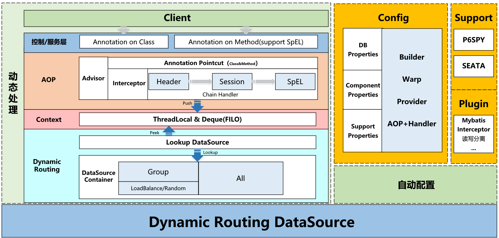

[](http://www.apache.org/licenses/LICENSE-2.0)

# Rukawa 

> **rukawa**是一个基于SpringBoot的动态数据源工具Starter


:mask:疫情无情，人有情，**Star**:star:一下吧 :point_up:


## 整体设计




## Features

- 支持动态多数据源
- 支持远端接口获取数据源配置（EventPublisher）
- 支持动态增加数据源（remote.config-endpoint）
- 支持p6spy监控sql，支持自定义sql日志输出
- 支持分布式事务seata
- 支持mybatis插件实现读写分离
- 支持数据源分组（策略查找）

## Quick Start

* git clone & mvn install  到本地（todo	 发布到maven）

* Add dependency

  ```java
      <dependency>
        <groupId>org.siu</groupId>
        <artifactId>rukawa</artifactId>
        <version>1.0.0.RC2</version>
      </dependency>
  ```

- 配置 yml：

  ```yml
  spring:
    datasource:
      dynamic:
        remote:
          # 从远端服务加载数据源配置（会覆盖本地配置）
          config-endpoint: "https://xxx/api/rukawa_db_properties"
        datasource-map:
          master:
            username: db_username
            password: db_pass
            url: jdbc:postgresql://postgres.host:5432
            driver-class-name: org.postgresql.Driver
          slave0_0:
            username: db_username
            password: db_pass
            url: jdbc:postgresql://postgres.host:5432/
            driver-class-name: org.postgresql.Driver
          slave0_1:
            username: db_username
            password: db_pass
            url: jdbc:postgresql://postgres.host:5432/
            driver-class-name: org.postgresql.Driver
          slave1_0:
            username: db_username
            password: db_pass
            url: jdbc:postgresql://postgres.host:5432/
            driver-class-name: org.postgresql.Driver
          slave1_1:
            username: db_username
            password: db_pass
            url: jdbc:postgresql://postgres.host:5432/
            driver-class-name: org.postgresql.Driver
  ```

- @DataSource使用

  ```java
  // 推荐在方法上使用
    // 如：你在控制层class上使用，但是其他人添加了某块代码并不需要动态切换数据源
    
    
    // Usage1:在控制层Class使用注解
    @RestController
    @DataSource("slave1_1") 
    // Or @DataSource("#header.request_ds") // HttpRequest header 添加 request_ds='slave1_1'
    // Or @DataSource("#session.request_ds") // HttpRequest session 添加 request_ds='slave1_1'
    public class Controller {
    }
    
    // Usage2:在Method上使用注解
    public class ServiceImpl implements Service {
    
      @Override
      @DataSource("#session.request_ds")
      public Object session() {
        // do something
      }
    
      @Override
      @DataSource("#header.request_ds")
      public Object header() {
        // do something
      }
    
      @Override
      @DataSource("#requestObj.ds")
      public Object spEL(RequestObj requestObj) {
        // do something
      }
    
      @Override
      @DataSource("slave1_1")
      public Object derict() {
        // do something
      }
    }
  ```

- 在线添加数据源（监听模式）

   ```java
      @Resource
      EventPublisher eventPublisher;
  
      @Test
      public void test() {
          DataSourceProperty property = new DataSourceProperty();
          property.setDriverClassName("org.h2.Driver");
          property.setUrl("jdbc:h2:mem:test");
          property.setUsername("sa");
          property.setPassword("");
  
          AddDataSourceEvent event = new AddDataSourceEvent("tets111", property);
          eventPublisher.publishEvent(event);
      
      }
   ```

  

## TODO

1. AOP部分实现
2. 优化Seata部分
3. 支持druid


## Feedback

 [gshiwen@gmail.com](mailto:gshiwen@gmail.com)

## License

[Apache License 2.0](LICENSE)


