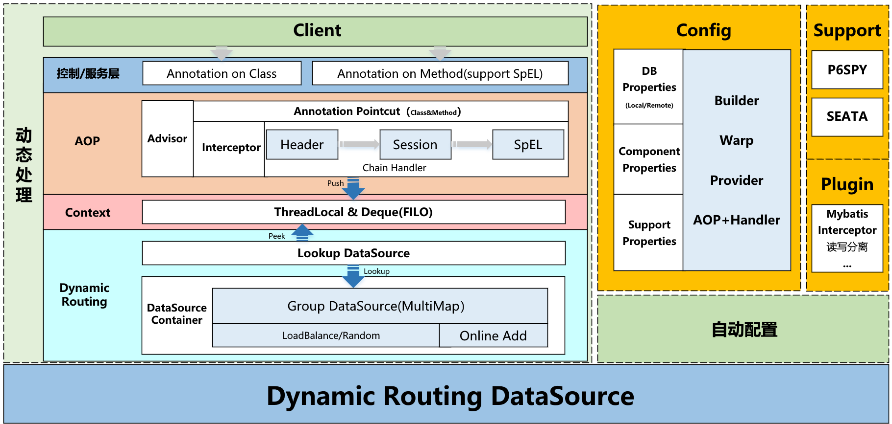

[](http://www.apache.org/licenses/LICENSE-2.0)

# Rukawa 

> **rukawa**是一个基于SpringBoot的动态数据源工具Starter


:mask:疫情无情，人有情，**Star**:star:一下吧 :point_up:


## 整体设计




## Features

- 支持动态多数据源
- 支持远端接口获取数据源配置（EventPublisher）
- 支持动态增加数据源（remote.config-endpoint）
- 支持p6spy监控sql，支持自定义sql日志输出
- 支持分布式事务seata
- 支持mybatis插件实现读写分离
- 支持数据源分组（策略查找）

## Quick Start

* git clone & mvn install  到本地（todo	 发布到maven）

* Add dependency

  ```java
      <dependency>
        <groupId>org.siu</groupId>
        <artifactId>rukawa</artifactId>
        <version>1.0.0.RC2</version>
      </dependency>
  ```

- 配置 yml：

  ```yml
  spring:
    datasource:
      dynamic:
        remote:
          # 从远端服务加载数据源配置（会覆盖本地配置）
          config-endpoint: "https://xxx/api/rukawa_db_properties"
        datasource-map:
          master:
            username: db_username
            password: db_pass
            url: jdbc:postgresql://postgres.host:5432
            driver-class-name: org.postgresql.Driver
          slave0_0:
            username: db_username
            password: db_pass
            url: jdbc:postgresql://postgres.host:5432/
            driver-class-name: org.postgresql.Driver
          slave0_1:
            username: db_username
            password: db_pass
            url: jdbc:postgresql://postgres.host:5432/
            driver-class-name: org.postgresql.Driver
          slave1_0:
            username: db_username
            password: db_pass
            url: jdbc:postgresql://postgres.host:5432/
            driver-class-name: org.postgresql.Driver
          slave1_1:
            username: db_username
            password: db_pass
            url: jdbc:postgresql://postgres.host:5432/
            driver-class-name: org.postgresql.Driver
  ```

- @DataSource使用

  ```java
  /**
   *
   * @Author Siu
   * @Date 2020/3/4 16:23
   * @Version 0.0.1
   */
  @Slf4j
  @RestController
  @RequestMapping("/v1/api")
  public class UserController {
  
  
      @Resource
      private UserService userService;
  
  
      @GetMapping("/get_ds_from_header")
      public Object header() {
          userService.getDsFromHeader();
          return "success";
      }
  
      @GetMapping("/get_ds_from_session")
      public Object session() {
          userService.getDsFromSession();
          return "success";
      }
  
      @GetMapping("/get_ds_from_param")
      public Object param(String ds) {
          userService.getDsFromParam(new Param(ds));
          return "success";
      }
  
  }
  
  /**
   * @Author Siu
   * @Date 2020/3/29 9:31
   * @Version 0.0.1
   */
  @Slf4j
  @Service
  @DataSource("primary")
  public class UserService {
  
      @Resource
      DSLContext dsl;
  
      private static final Random random = new Random();
  
      @DataSource("#header.ds")
      public void getDsFromHeader() {
          dsl.insertInto(Users.USERS, Users.USERS.ID, Users.USERS.NAME, Users.USERS.AGE, Users.USERS.PASS)
                  .values(random.nextLong(), "siu", 29, "pass").execute();
      }
  
      @DataSource("#session.ds")
      public void getDsFromSession() {
          dsl.insertInto(Users.USERS, Users.USERS.ID, Users.USERS.NAME, Users.USERS.AGE, Users.USERS.PASS)
                  .values(random.nextLong(), "siu", 29, "pass").execute();
      }
  
      @DataSource("#param.ds")
      public void getDsFromParam(Param param) {
          log.info("ds:[{}]", param.getDs());
          dsl.insertInto(Users.USERS, Users.USERS.ID, Users.USERS.NAME, Users.USERS.AGE, Users.USERS.PASS)
                  .values(random.nextLong(), "siu", 29, "pass").execute();
      }
  
  
  ```
  
- 远程服务中获取DB配置

   ```txt
   # 从远端服务加载数据源配置（会覆盖本地配置）
   config-endpoint: "https://xxx/api/rukawa_db_properties"
   
   接口需返回JSON：
   {
     "code":200,
     "message":"success",
     "data":{
       "master":{
         "url":"jdbc:h2:mem:test",
         "driver-class-name":"org.h2.Driver",
         "username":"sa",
         "password":""
   
       }
     }
   }
   ```

   

- 在线添加数据源（监听模式）

   ```java
      @Resource
      EventPublisher eventPublisher;
    
      @Test
      public void test() {
          DataSourceProperty property = new DataSourceProperty();
          property.setDriverClassName("org.h2.Driver");
          property.setUrl("jdbc:h2:mem:test");
          property.setUsername("sa");
          property.setPassword("");
    
          AddDataSourceEvent event = new AddDataSourceEvent("tets111", property);
          eventPublisher.publishEvent(event);
      
      }
   ```

## TODO

1. AOP部分实现
2. 优化Seata部分
3. 支持druid


## Feedback

 [gshiwen@gmail.com](mailto:gshiwen@gmail.com)

## License

[Apache License 2.0](LICENSE)


